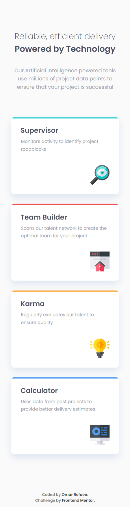

# Frontend Mentor - Four card feature section solution

This is a solution to the [Four card feature section challenge on Frontend Mentor](https://www.frontendmentor.io/challenges/four-card-feature-section-weK1eFYK).

## Table of contents

-   [Overview](#overview)
    -   [The challenge](#the-challenge)
    -   [Screenshot](#screenshot)
    -   [Links](#links)
-   [My process](#my-process)
    -   [Built with](#built-with)
-   [Author](#author)

## Overview

### The challenge

Users should be able to:

-   View the optimal layout for the site depending on their device's screen size

### Screenshot

### Links

-   Solution URL: [Solution URL](https://your-solution-url.com)
-   Live Site URL: [Live Site URL](https://your-live-site-url.com)

## My process

### Built with

-   Semantic HTML5 markup
-   CSS3
-   Flexbox
-   Mobile-first workflow
-   [SCSS](https://sass-lang.com) - CSS Preprocessor

## Author

-   Website - [Omar Refaee](https://www.github.com/omarrefaee)
-   Frontend Mentor - [@OmarRefaee](https://www.frontendmentor.io/profile/OmarRefaee)
-   Facebook - [@OmarRefaee0](https://www.Facebook.com/OmarRefaee0)
